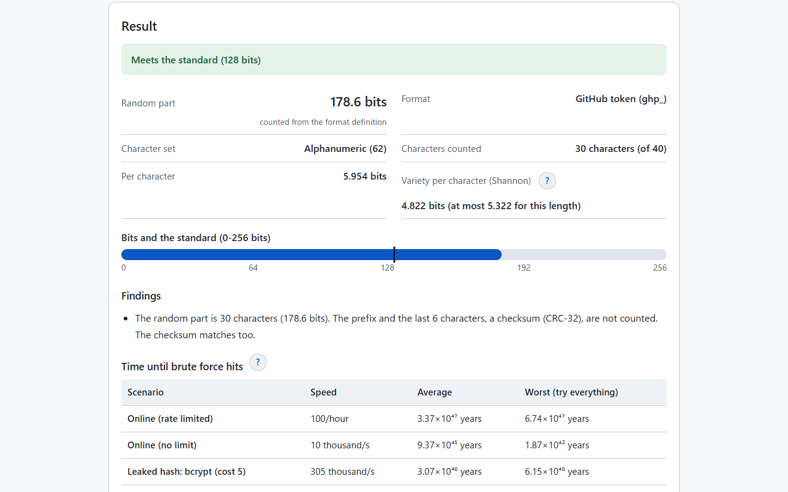
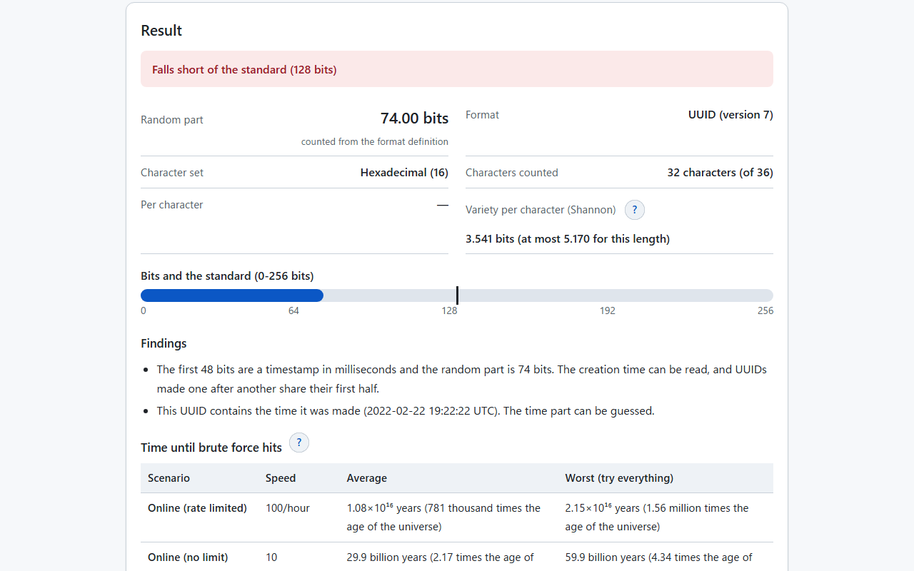
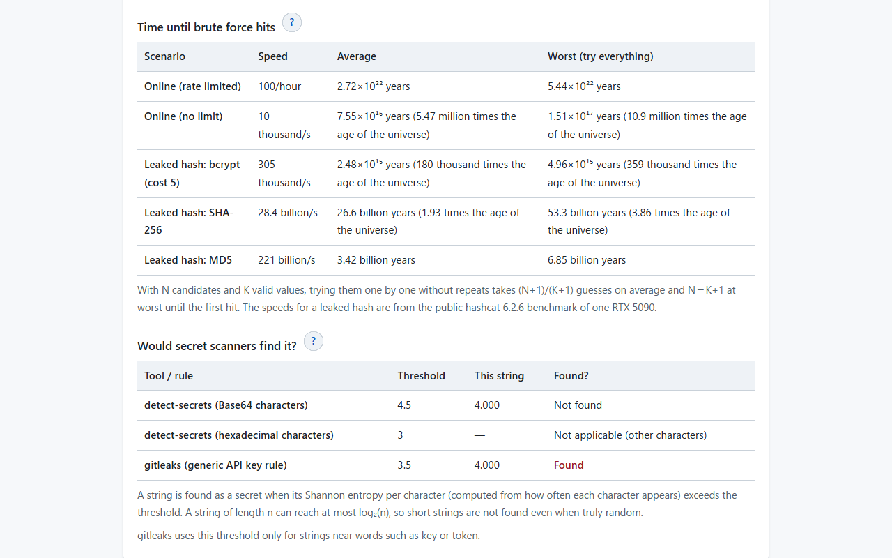
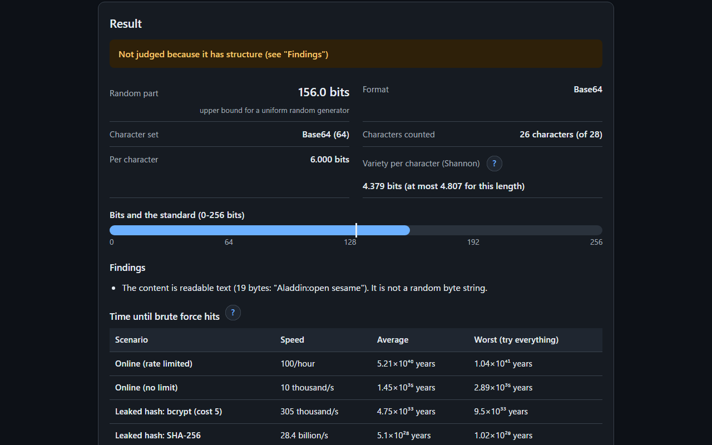

English · [日本語](README.md)

# Token Entropy Estimator - Token Strength Estimation via Entropy


[](https://ipusiron.github.io/token-entropy-estimator/)

**Day048 - 100 Security Tools with Generative AI**

Paste a token, API key or secret, and the tool estimates how many random bits it has from its characters, length and format (UUID, JWT, GitHub token and others), and how long brute force would take to hit it in each attack scenario. Whether a string is random depends on how it was made, not on the string, so the bits are treated as an upper bound "if it was made with a uniform random generator", and structure such as repeated characters, runs or readable content is reported. The standard to judge by can be chosen from OWASP, NIST and RFCs, and the tool also shows whether the thresholds of detect-secrets and gitleaks would find the string. The input is handled only inside your browser and is never sent anywhere.

---

## 🌐 Demo

👉 **[https://ipusiron.github.io/token-entropy-estimator/](https://ipusiron.github.io/token-entropy-estimator/)**

You can try it directly in your browser.

---

## 📸 Screenshots

>
>
>*A GitHub-style token. The 30 random characters without the prefix and the checksum (CRC-32) are counted: 178.6 bits, which meets the 128-bit standard*

>
>
>*UUID v7. The first 48 bits are a timestamp, so the random part is 74 bits. The creation time (2022-02-22 19:22:22 UTC) can be read too*

>
>
>*16 alphanumeric characters. Time by scenario, and whether secret scanners would find it (16 characters never exceed the Base64 limit of 4.5, even when truly random)*

>
>
>*The Base64 sample reads as "Aladdin:open sesame", so it is not judged because it has structure (dark mode)*

---

## ✨ Features

### 🔍 Reading the string

- Picks the character set as the smallest standard set that contains every character seen (digits, hexadecimal, Base32, alphanumeric, Base64, base64url). If none fits, the sizes of lowercase, uppercase, digits, symbols and space are added up
- Reads the format. UUIDs are counted by version (RFC 9562), and versions 1, 6 and 7 also show when they were made. For JWTs, the alg in the header is shown with a note that a JWT is not measured by entropy. GitHub tokens have their checksum (CRC-32) verified, and only the 30 random characters are counted
- Padding `=` is not counted. Characters are counted by code point (one emoji is one character)
- If you know how the string was made, you can specify the character set (any number is allowed too)

### 🧩 Reporting structure

- Repeated characters, repeated short blocks, ascending or descending runs (abcd, 9876), keyboard runs (qwerty) and skewed use of characters
- Runs are reported only when the expected number of chance occurrences in a random string of the same length and set size is below 0.001 (fewer than 0.5% of truly random strings are reported by mistake)
- Base64, base64url and hexadecimal are decoded, and readable text content is reported (12 bytes or more)
- Hexadecimal strings of 32, 40, 64 or 128 characters have the length of a hash, and prefix-like parts such as `sk_live_` are reported with the bits without the prefix
- When there is structure, the string is not judged and the bits are shown as an upper bound

### ⏱️ Time and standards

- Shows the average and worst time for each attack scenario (online with and without a rate limit; bcrypt, SHA-256 and MD5 when a hash leaked)
- You can enter the number of valid values (tokens in use at the same time), the number of GPUs and a custom speed
- Times are written with large-number words (thousand, million, billion, trillion, then powers of 10), with a comparison to the age of the universe
- The standard can be chosen from OWASP, NIST and RFCs (64, 112, 128, 160 and 256 bits), or entered as any number of bits
- Shows the thresholds of detect-secrets and gitleaks next to the Shannon entropy per character, and whether the string would be found

### 🖥️ Screen

- Japanese and English (the initial language is taken from `?lang=` in the URL, then the saved choice, then the browser language; switching keeps the input and results)
- Light and dark modes (following the OS setting, with a button to switch)
- Changing any input or assumption redraws the whole result from the same state
- Help opens in a dialog from the `?` buttons (with sources). Esc closes it
- No horizontal overflow even on a 320 px wide smartphone. On narrow screens, tables turn into one block per row
- Works when `index.html` is opened directly as a file (`file://`), so it can be used offline

---

## 📖 Usage

1. Open the public version ([https://ipusiron.github.io/token-entropy-estimator/](https://ipusiron.github.io/token-entropy-estimator/)), or download the repository and open `index.html`
2. Paste a token or press a sample button. The result appears right away
3. Under "Findings", check the notes on the format and whether there is structure
4. Under "Change the assumptions", change the standard, the number of valid values, the number of GPUs or the character set, and see how the time and judgment change
5. Under "Would secret scanners find it?", see whether a scanner would find the string in your code

The buttons at the top right switch between Japanese and English and between light and dark.

---

## 🔬 How the estimate works

The bits are the number of characters counted × log₂(set size). The character set is the smallest standard set that contains every character seen.

| Character set | Set size | Bits per character | Chosen when |
|---|---|---|---|
| Digits | 10 | 3.322 | Only digits |
| Hexadecimal | 16 | 4.000 | Only digits and a-f (all lowercase or all uppercase) |
| Base32 | 32 | 5.000 | Only uppercase letters and 2-7 (trailing `=` is not counted) |
| Base64 | 64 | 6.000 | Contains `+`, `/` or a trailing `=` |
| base64url | 64 | 6.000 | Contains `-` or `_`, and otherwise only letters and digits |
| Combination of character kinds | 26-95 | 4.700-6.570 | None of the above (lowercase 26, uppercase 26, digits 10, symbols 32 and space 1 added up) |

- The set can look smaller than the one actually used (an alphanumeric token that happens to have no digits, for example). If you know how it was made, choose it under "Character set"
- If the string contains non-ASCII characters (Japanese, emoji and so on), the set is not chosen automatically (enter a number to calculate)

For strings with a defined format, only the random part defined by the format is counted.

| Format | Random part | Notes |
|---|---|---|
| UUID v4 | 122 bits | Of the 128 bits, the 6 bits for the version and variant are fixed |
| UUID v7 | 74 bits | The first 48 bits are a timestamp in milliseconds, which is read and shown |
| UUID v1, v6 | Not counted | Made from a timestamp and a device number. Do not use as a secret |
| UUID v3, v5 | Not counted | Made from the hash of a name. The same name gives the same value |
| GitHub token | 178.6 bits | The 30 characters without the prefix (such as `ghp_`) and the 6-character checksum |
| JWT | Not counted | Anyone can read the header and payload. The strength comes from the signing key (256 bits or more for HS256) |

- The UUID examples are checked against the values in the appendix of RFC 9562 (the v7 example `017F22E2-79B0-7CC3-98C4-DC0C0C07398F` is 2022-02-22 19:22:22 UTC)
- The GitHub checksum is the CRC-32 (IEEE 802.3) of the 30 random characters, written as 6 characters of Base62 in the order 0-9A-Za-z. GitHub's blog does not state the order, so it was checked against two sources: the credsweeper implementation and the draft ASF standard for secret tokens

The samples give the following values (judged against the default 128-bit standard).

| Sample | Format | Bits | Judgment |
|---|---|---|---|
| UUID v4 | UUID (version 4) | 122.0 | Short |
| UUID v7 | UUID (version 7) | 74.00 | Short |
| Hex(32) | Hexadecimal | 128.0 | Meets |
| Base64 | Base64 | 156.0 | Structure |
| Alnum 16 | Combination of character kinds | 95.27 | Short |
| Alnum 32 | Combination of character kinds | 190.5 | Meets |
| JWT | JWT (signed token, alg: HS256) | — | Not applicable |
| GitHub style | GitHub token (ghp_) | 178.6 | Meets |
| Same letter | Hexadecimal | 64.00 | Structure |
| Password1! | Combination of character kinds | 65.55 | Short |

---

## ⏱️ Brute-force time

With N (= 2 to the power of the bits) candidates and K valid values, trying them one by one without repeats takes (N+1)/(K+1) guesses on average and N−K+1 at worst until the first hit. Dividing by the speed of each scenario gives the time.

| Scenario | Speed | Source |
|---|---|---|
| Online (rate limited) | 100 per hour | The zxcvbn assumption |
| Online (no limit) | 10,000 per second | The example in the OWASP Session Management Cheat Sheet |
| Leaked hash: bcrypt (cost 5) | 304,800 per second | hashcat 6.2.6, one RTX 5090 (benchmark default cost) |
| Leaked hash: SHA-256 | 28.35 billion per second | Same as above |
| Leaked hash: MD5 | 220.6 billion per second | Same as above |

- A leaked hash means the hash of the token leaked and is brute-forced offline; the speed is multiplied by the number of GPUs. If the token is stored in plain text and leaks, it can be used whatever its bits
- The OWASP example (100,000 session IDs of 64 bits in use, 10,000 guesses per second) gives about 584.5 years when 100000 is entered as the number of valid values (OWASP says about 585 years)
- 16 alphanumeric characters (95.27 bits) at a billion guesses per second take about 755 billion years on average (54.7 times the age of the universe)

---

## 📏 Standards

| Standard | Bits | Source |
|---|---|---|
| Session ID | 64 | OWASP Session Management Cheat Sheet, NIST SP 800-63B-4 (session secrets) |
| Long-lived key (through 2030) | 112 | NIST SP 800-57 Part 1 Rev. 5, Table 4 |
| Long-lived key (from 2031) | 128 | NIST SP 800-57 Part 1 Rev. 5, Table 4 |
| One-time password key | 160 | RFC 4226 R6 (at least 128 bits required, 160 bits recommended) |
| JWT HS256 key | 256 | RFC 7518 3.2 |

- The default is 128 bits. UUID v4 (122 bits) meets the 112-bit standard but not the 128-bit one
- Applying NIST security strengths to the random part of API keys and tokens is used as a guide

---

## 🔍 Would secret scanners find it?

Secret scanners treat a string as a secret when its Shannon entropy per character (computed from how often each character appears) exceeds a threshold.

| Tool / rule | Threshold | Applies to |
|---|---|---|
| detect-secrets (Base64) | 4.5 | Strings made only of letters, digits and `+/-_=` |
| detect-secrets (hexadecimal) | 3.0 | Strings made only of hexadecimal characters (1.2/log₂(length) is subtracted for digit-only strings) |
| gitleaks (generic API key) | 3.5 | Strings near words such as key or token |

A string of length n can reach at most log₂(n) per character. Even truly random alphanumeric strings of 22 characters or less (log₂22≈4.46) never exceed the Base64 limit of 4.5. During development, 10,000 random alphanumeric strings were made for each length, and the share above 4.5 was as follows.

| Length | Share above 4.5 |
|---|---|
| 16 | 0.0% |
| 20 | 0.0% |
| 24 | 4.7% |
| 32 | 61.6% |
| 40 | 97.5% |

- Short keys are not found by entropy, so combine entropy with rules for fixed formats (patterns such as those in Day031 Git Secrets Playground)
- Both detect-secrets and gitleaks flag a string only when it is greater than the threshold (exactly equal is not flagged)

---

## 🎯 Use cases

- Designing API keys and session IDs: decide the length from the target bits (128 bits means 32 hexadecimal or 22 alphanumeric characters). See that UUID v4 has 122 bits and v7 has 74 bits with a timestamp, and decide not to use v7 as a secret
- Code review and audits: when reviewing how tokens are generated, paste samples to get a sense of whether the random part is large enough (check the generator itself in the code)
- Configuring secret scanning: confirm that the thresholds of detect-secrets and gitleaks miss short keys, and explain why pattern rules are needed too
- Classes on information security and information theory: experience how bits, the number of combinations and brute-force time relate, through very large numbers such as powers of 10. The difference between the Shannon entropy of a string and the entropy of how it was made can be shown too
- Probability and statistics classes: confirm with the OWASP 585-year example that more valid values mean one of them is hit sooner
- CTFs and security exercises: get a sense of whether given tokens or session IDs are guessable (a UUID v1 with a timestamp, readable Base64 content, repeated characters)
- Making puzzles and cipher games: estimate how long a passphrase or random string would hold out against brute force (noting that words people make up are tried first with dictionaries)
- At home: check how many bits the default router or Wi-Fi password (alphanumerics made by a machine) has. Check passwords people make up with [Day001 Password Checker](https://ipusiron.github.io/password-checker/)
- Articles and teaching material: produce the numbers for tables and figures, with sources for the attack speeds (the hashcat RTX 5090 benchmark) and the standards
- With other tools: look inside JWTs with [Day053 JWT Inspector](https://ipusiron.github.io/jwt-inspector/), hexadecimal strings that look like hashes with [Day002 Hash Detector](https://ipusiron.github.io/hash-detector/), and keyboard runs with [Day089 Keywalk Analyzer](https://ipusiron.github.io/keywalk-analyzer/)

---

## 🔒 Security and privacy

- The string you enter is handled only inside the browser. Nothing is sent to or stored on a server (it is not put in the URL either)
- A Content Security Policy (meta) limits scripts, styles and images to the same site and allows no connections (connect-src). No inline scripts, inline event handlers or style attributes are used
- Every character and result is put on the screen with `textContent` (never interpreted as HTML)
- Only the first 10,000 characters are analyzed
- Only the theme and language choices are saved in localStorage (the tool works where storage is unavailable)
- External links open in a new tab without passing the referrer (`rel="noopener noreferrer"`, and `referrer` is `no-referrer`)

See [SECURITY.md](SECURITY.md) for details.

---

## ⚠️ Notes and limitations

- A single string cannot tell you whether it was made randomly. The bits shown are the upper bound for a uniform random generator
- Passwords people make up are tried first with dictionaries and rules, so they are much weaker than this estimate (no dictionary check is done)
- Structure warnings are limited to things unlikely to happen by chance. No warning does not mean the string is random
- The attack speeds are values from public benchmarks and examples. Real speeds vary a lot with the hash settings, hardware and service limits
- Brute force by quantum computers (Grover's search) is not considered. As a rough guide, the strength becomes that of half the bits
- Formats of other companies' API keys (prefixes, checksums) are not read, except GitHub tokens. Prefix-like parts are only reported

---

## 🧪 Tests

The logic (`js/entropy-core.js`) is a plain script that does not depend on the DOM, and is tested with the standard Node.js test runner (`node:test`) by loading it with `vm`. There are no dependencies.

```bash
npm test
```

- Node.js 22 or later. Runs automatically in GitHub Actions on every push and pull request
- Known answers are computed separately in Python (zlib, uuid, base64, math): the CRC-32 check value (`123456789` → `cbf43926`), the versions and times of the UUID examples in RFC 9562, and the header of the JWT example in RFC 7519
- Choosing the character set, counting padding and code points, structure warnings (fewer than 0.5% of truly random strings reported, with a seeded random generator), readable Base64 and hexadecimal
- Guesses until a hit (the OWASP 585-year example, the 755-billion-year example), time units, large-number words, secret scanner thresholds (exactly equal is not flagged)
- CSP, labels and aria-live in index.html, color contrast (at least 4.5:1 in both light and dark modes), line length, the keys of both dictionaries, and no Japanese in the English screen
- The tables and numbers in both READMEs are also recomputed from the implementation

---

## 📁 Directory structure

```
token-entropy-estimator/
├── .github/                # GitHub settings
│   └── workflows/          # GitHub Actions workflows
│       └── test.yml        # Runs npm test on push and pull requests
├── assets/                 # Images
│   ├── en/                 # Screenshots for the English README
│   │   ├── screenshot.png  # GitHub token
│   │   ├── screenshot2.png # UUID v7
│   │   ├── screenshot3.png # Time by scenario and secret scanners
│   │   └── screenshot4.png # Readable Base64, dark
│   ├── favicon.svg         # Favicon
│   ├── screenshot.png      # Screenshot for the Japanese README (GitHub token)
│   ├── screenshot2.png     # Screenshot for the Japanese README (UUID v7)
│   ├── screenshot3.png     # Screenshot for the Japanese README (time and secret scanners)
│   └── screenshot4.png     # Screenshot for the Japanese README (readable Base64, dark)
├── js/                     # Scripts other than the screen (plain scripts that work from file://)
│   ├── entropy-core.js     # Calculation (character set, format, structure, secret scanners, time, standards)
│   ├── i18n.js             # Choosing and switching the language (Japanese, English)
│   ├── messages.js         # Strings shown on the screen (Japanese, English)
│   ├── samples.js          # Samples
│   ├── theme-init.js       # Applies the theme at the start of loading
│   └── theme.js            # Light/dark switching
├── test/                   # Tests (node:test)
│   ├── contrast.test.js    # Color contrast, sizes of fields and controls
│   ├── core.test.js        # Character set, format, structure warnings, input validation
│   ├── format.test.js      # Line length, line endings, minimum line counts
│   ├── html.test.js        # CSP, element ids, labels, aria-live, help
│   ├── i18n.test.js        # Keys of both languages, no Japanese in English, initial language
│   ├── load.js             # Loads the scripts in js/ into the tests
│   ├── messages.test.js    # Where strings live and their keys
│   ├── readme.test.js      # Tables, structure, tree and images of both READMEs
│   ├── scanners.test.js    # Shannon entropy and secret scanner thresholds
│   └── time.test.js        # Guesses until a hit, time units, large-number words
├── .gitignore              # Git ignore settings
├── .nojekyll               # Tells GitHub Pages not to use Jekyll
├── CLAUDE.md               # Development notes for Claude Code
├── LICENSE                 # License (MIT)
├── README.en.md            # This document
├── README.md               # Japanese document
├── SECURITY.md             # Security design
├── index.html              # Screen
├── package.json            # npm test settings (no dependencies)
├── script.js               # Screen logic (redraws everything from the state)
├── style.css               # Styles (light and dark)
└── theory.md               # Theory notes on entropy and brute force (Japanese)
```

---

## 💻 Requirements

- Tested with the latest Chrome, Edge and Firefox (Safari has not been tested)
- The public version can be used as it is, and `index.html` also works when opened directly as a file

---

## 📄 License

- See the `LICENSE` file for the license of the source code.

---

## 🛠️ About this tool

This tool was developed as part of the "100 Security Tools with Generative AI" project.
The project creates and publishes a wide variety of security-related tools over 100 days with the help of AI.

For details about the project and other tools, see the following page.

🔗 [https://akademeia.info/?page_id=42163](https://akademeia.info/?page_id=42163)
