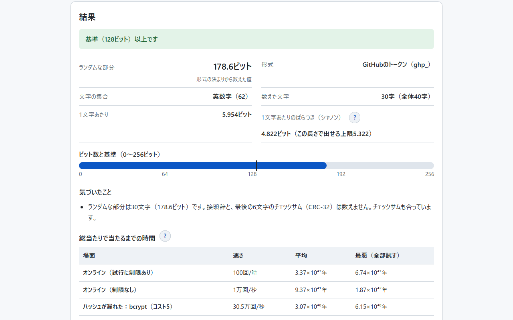
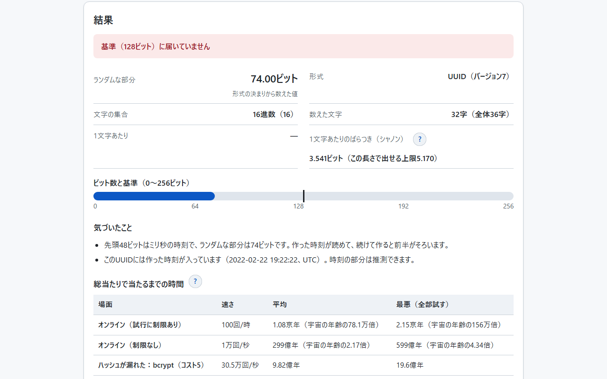
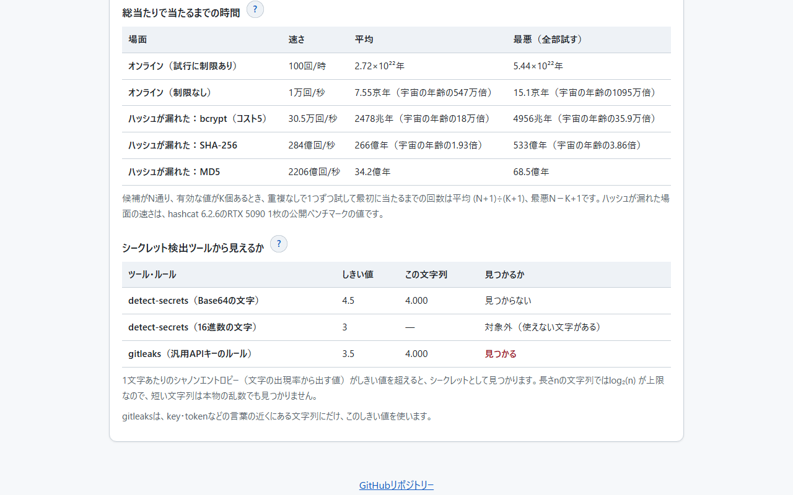
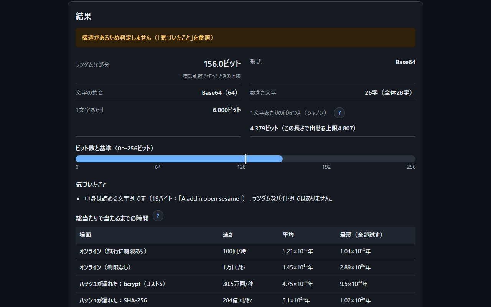
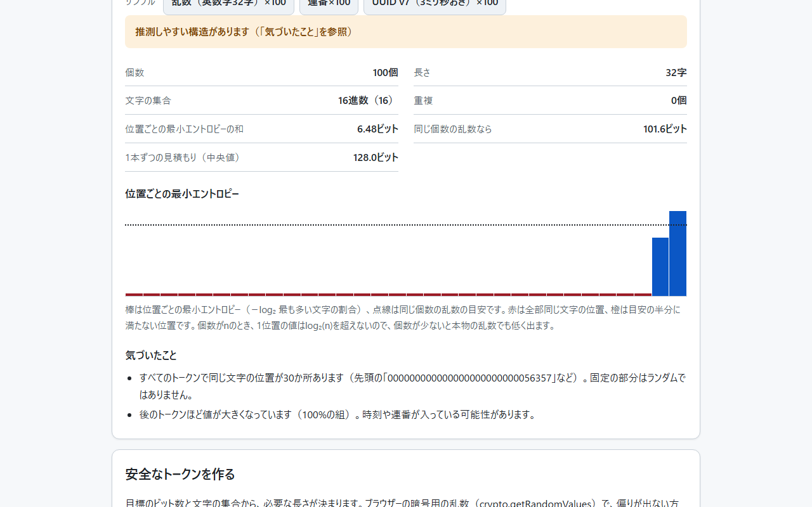
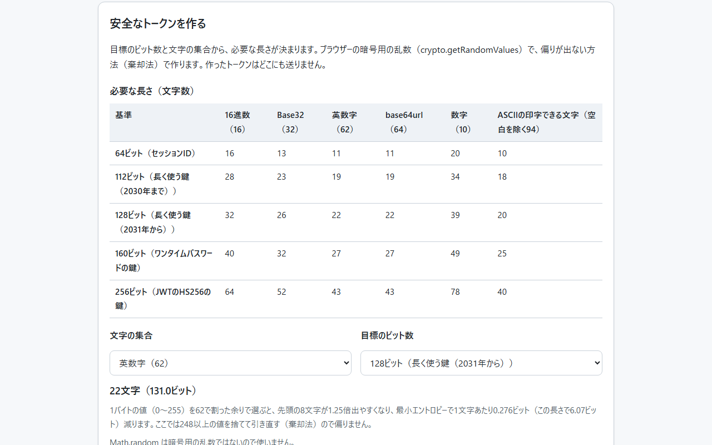

<!--
---
id: day048
slug: token-entropy-estimator

title: "Token Entropy Estimator"

subtitle_ja: "エントロピーによるトークン強度の見積もりツール"
subtitle_en: "Token Strength Estimation via Entropy"

description_ja: "トークン・APIキー・鍵の文字の種類・長さ・形式（UUID・JWT・GitHubのトークン）から、ランダムな部分のビット数、攻撃の場面ごとの総当たりの時間、規範の基準との比較、シークレット検出ツールからの見え方を出すツール"
description_en: "Estimates the random bits of tokens, API keys and secrets from their characters, length and format (UUID, JWT, GitHub tokens), with brute-force time by attack scenario, comparison with standards and how secret scanners see them"

category_ja:
  - 認証
  - パスワード解読
  - セキュリティ分析
category_en:
  - Authentication
  - Password Cracking
  - Security Analysis

difficulty: 4

tags:
  - entropy
  - token
  - password
  - brute-force
  - uuid
  - jwt
  - secret-scanning
  - security
  - education

repo_url: "https://github.com/ipusiron/token-entropy-estimator"
demo_url: "https://ipusiron.github.io/token-entropy-estimator/"

hub: true
---
-->

[English](README.en.md) · 日本語

# Token Entropy Estimator - エントロピーによるトークン強度の見積もりツール


[](https://ipusiron.github.io/token-entropy-estimator/)

**Day048 - 生成AIで作るセキュリティツール100**

トークン・APIキー・鍵を貼り付けると、文字の種類と長さ、形式（UUID・JWT・GitHubのトークンなど）から、ランダムな部分が何ビットあるかと、攻撃の場面ごとに総当たりで当たるまでの時間を見積もります。ランダムかどうかは文字列ではなく作り方で決まるので、出すビット数は「一様な乱数で作ったとしたら」の上限として扱い、同じ文字の繰り返し・並び・中身が読めるといった構造があれば知らせます。判定の基準はOWASP・NIST・RFCから選べ、detect-secretsやgitleaksのしきい値から見て見つかるかも出します。入力はブラウザーの中だけで扱い、外部へは送りません。

---

## 🌐 デモページ

👉 **[https://ipusiron.github.io/token-entropy-estimator/](https://ipusiron.github.io/token-entropy-estimator/)**

ブラウザーで直接お試しいただけます。

---

## 📸 スクリーンショット

>
>
>*GitHub形式のトークン。接頭辞とチェックサム（CRC-32）を除いたランダムな30文字を数え、178.6ビットで128ビットの基準以上*

>
>
>*UUID v7。先頭48ビットは時刻なので、ランダムな部分は74ビット。作った時刻（2022-02-22 19:22:22 UTC）も読める*

>
>
>*英数字16字。場面ごとの時間と、シークレット検出ツールから見えるか（16字は本物の乱数でもBase64側の4.5を超えない）*

>
>
>*Base64のサンプルは「Aladdin:open sesame」と読めるので、構造があるとして判定しない（ダークモード）*

>
>
>*連番のトークン100個。32か所のうち末尾の数か所を除いてすべて同じ文字（赤）で、後のものほど値が大きい。位置ごとの最小エントロピーの和は、同じ個数の乱数の目安より大きく下回る*

>
>
>*目標のビット数と文字の集合から必要な長さを出し、棄却法で作る。英数字では、1バイトの余りで選ぶと8文字が1.25倍出やすいことも示す*

---

## ✨ 機能

### 🔍 文字列を読み取る

- 文字の集合を、見た文字をすべて含むいちばん小さい標準の集合（数字・16進数・Base32・英数字・Base64・base64url）から選ぶ。どれにも当たらなければ、小文字・大文字・数字・記号・空白の数を足す
- 形式を読む。UUIDは版（RFC 9562）からランダムな部分を数え、v1・v6・v7は作った時刻も出す。JWTはヘッダーのalgを読み、エントロピーで測る対象ではないと知らせる。GitHubのトークンはチェックサム（CRC-32）を検算し、ランダムな30文字だけを数える
- 埋め草の`=`は数えない。文字はコードポイントで数える（絵文字1つは1文字）
- 作り方がわかっているときは、文字の集合を指定できる（自由な数も可）

### 🧩 構造を知らせる

- 同じ文字の繰り返し、短いかたまりの繰り返し、上り・下りの並び（abcd・9876）、キーボードの並び（qwerty）、使う文字の偏り
- 並びは、同じ長さ・同じ文字の数のランダムな文字列に偶然現れる回数の期待値が0.001未満のときだけ知らせる（本物の乱数を誤って知らせる割合は0.5%未満）
- Base64・base64url・16進数を解読して、中身が読める文字列なら知らせる（12バイト以上）
- 16進数32・40・64・128文字はハッシュ値と同じ長さ、`sk_live_`のような接頭辞らしい部分は、除いたときのビット数も出す
- 構造があるときは判定せず、ビット数は上限として示す

### ⏱️ 時間と基準

- 攻撃の場面ごとに、平均と最悪の時間を並べる（オンラインの制限あり・なし、ハッシュが漏れたときのbcrypt・SHA-256・MD5）
- 有効な値の数（同時に使われているトークンの数）、GPUの枚数、自由な速さを入れられる
- 時間は日本語の大きな数（万・億・兆・京、それを超えたら10の指数）で書き、宇宙の年齢との比も添える
- 判定の基準をOWASP・NIST・RFCから選ぶ（64・112・128・160・256ビット）。自由なビット数も入れられる
- detect-secrets・gitleaksのしきい値と、1文字あたりのシャノンエントロピーを並べ、見つかるかを出す

### 📦 複数のトークンを比べる

- 同じ仕組みで作ったトークンを1行に1つずつ貼り付けると、位置ごとの最小エントロピーを棒で並べ、同じ個数の乱数の目安と比べる
- 全部同じ文字の位置（接頭辞など）、重複、後のものほど大きい順番（時刻・連番）、目安の半分に満たない位置を知らせる
- サンプル3種（乱数・連番・3ミリ秒おきのUUID v7、各100個）。20個未満は判定しない

### 🔐 安全なトークンを作る

- 判定の基準（64〜256ビット）と文字の集合（16進数・Base32・英数字・base64url・数字・印字できるASCII）ごとに、必要な長さを表で出す
- `crypto.getRandomValues`と棄却法で、偏りなく作る。コピー、結果欄での確認、100個を一括分析へ送ることができる
- 1バイトの余りで文字を選んだときの偏りを、選んだ文字の集合で計算して示す

### 🖥️ 画面

- 日本語・英語（初期の言語はURLの`?lang=`、保存した選択、ブラウザーの言語の順。切り替えても入力と結果はそのまま）
- ライト／ダークモード（OSの設定に従い、ボタンでも切り替え）
- 入力・前提のどれを変えても、同じ状態から全体を描き直す
- ヘルプは`?`ボタンで開くダイアログ（出典つき）。Escで閉じる
- 幅320pxのスマートフォンでも横にはみ出さない。幅の狭い画面では表を1行ずつのかたまりにする
- ファイルとして直接開いても（`file://`）動く。ネットにつながない環境でも使える

---

## 📖 使い方

1. 公開版（[https://ipusiron.github.io/token-entropy-estimator/](https://ipusiron.github.io/token-entropy-estimator/)）を開くか、リポジトリーをダウンロードして`index.html`を開く
2. トークンを貼り付けるか、サンプルのボタンを押す。結果はすぐに出る
3. 「気づいたこと」で、形式の説明と構造の有無を確かめる
4. 「前提を変える」で、判定の基準・有効な値の数・GPUの枚数・文字の集合を変えて、時間や判定がどう変わるかを見る
5. 「シークレット検出ツールから見えるか」で、コードに書いたときに検出ツールで見つかるかを確かめる

画面右上のボタンで、日本語と英語、ライトとダークを切り替えられます。

---

## 🔬 見積もりの仕組み

ビット数は、数えた文字数×log₂(文字の数)です。文字の集合は、見た文字をすべて含むいちばん小さい標準の集合を選びます。

| 文字の集合 | 文字の数 | 1文字あたりのビット | 選ぶ条件 |
|---|---|---|---|
| 数字 | 10 | 3.322 | 数字だけ |
| 16進数 | 16 | 4.000 | 数字とa〜f（大文字か小文字のどちらか）だけ |
| Base32 | 32 | 5.000 | 大文字と2〜7だけ（末尾の`=`は数えない） |
| Base64 | 64 | 6.000 | `+`・`/`・末尾の`=`のどれかを含む |
| base64url | 64 | 6.000 | `-`か`_`を含み、ほかは英数字 |
| 文字の種類の組み合わせ | 26〜95 | 4.700〜6.570 | 上のどれでもない（小文字26・大文字26・数字10・記号32・空白1を足す） |

- 実際の作り方の集合より小さく見えることがある（英数字のトークンにたまたま数字がない、など）。作り方がわかっていれば「文字の集合」で指定する
- ASCII以外の文字（日本語・絵文字など）を含むときは、自動では決めない（数を指定すれば計算する）

形式が決まっている文字列は、形式の決まりからランダムな部分だけを数えます。

| 形式 | ランダムな部分 | 補足 |
|---|---|---|
| UUID v4 | 122ビット | 128ビットのうち、版と変種の6ビットは固定 |
| UUID v7 | 74ビット | 先頭48ビットはミリ秒の時刻。時刻を読んで表示する |
| UUID v1・v6 | 数えない | 時刻と機器の番号から作る。秘密の値には使えない |
| UUID v3・v5 | 数えない | 名前のハッシュから作る。同じ名前なら同じ値 |
| GitHubのトークン | 178.6ビット | 接頭辞（`ghp_`など）とチェックサム6文字を除いた30文字 |
| JWT | 数えない | ヘッダーとペイロードは誰でも読める。強さは署名の鍵で決まる（HS256なら256ビット以上） |

- UUIDの例はRFC 9562の付録の値で確かめている（v7の`017F22E2-79B0-7CC3-98C4-DC0C0C07398F`は2022-02-22 19:22:22 UTC）
- GitHubのチェックサムは、ランダムな30文字のCRC-32（IEEE 802.3）を、0-9A-Za-zの順のBase62で6文字にしたもの。GitHubのブログは並び順を書いていないので、credsweeperの実装とASFの秘密トークン標準の草案の2つで確かめた

サンプルの値は次のとおりです（判定は既定の128ビットの基準）。

| サンプル | 形式 | ビット数 | 判定 |
|---|---|---|---|
| UUID v4 | UUID（バージョン4） | 122.0 | 届かない |
| UUID v7 | UUID（バージョン7） | 74.00 | 届かない |
| Hex(32) | 16進数 | 128.0 | 以上 |
| Base64 | Base64 | 156.0 | 構造あり |
| 英数16 | 文字の種類の組み合わせ | 95.27 | 届かない |
| 英数32 | 文字の種類の組み合わせ | 190.5 | 以上 |
| JWT | JWT（署名つきトークン、alg: HS256） | — | 対象外 |
| GitHub形式 | GitHubのトークン（ghp_） | 178.6 | 以上 |
| 同じ文字 | 16進数 | 64.00 | 構造あり |
| Password1! | 文字の種類の組み合わせ | 65.55 | 届かない |

---

## ⏱️ 総当たりの時間

候補がN（＝2のビット数乗）通り、有効な値がK個あるとき、重複なしで1つずつ試して最初に当たるまでの回数の期待値は (N+1)÷(K+1)、最悪はN−K+1です。これを場面ごとの速さで割って時間にします。

| 場面 | 速さ | 出典 |
|---|---|---|
| オンライン（試行に制限あり） | 100回/時 | zxcvbnの想定 |
| オンライン（制限なし） | 1万回/秒 | OWASP Session Management Cheat Sheetの例 |
| ハッシュが漏れた：bcrypt（コスト5） | 30.48万回/秒 | hashcat 6.2.6、RTX 5090 1枚（ベンチマーク既定のコスト） |
| ハッシュが漏れた：SHA-256 | 283.5億回/秒 | 同上 |
| ハッシュが漏れた：MD5 | 2206億回/秒 | 同上 |

- ハッシュが漏れた場面は、トークンのハッシュ値が漏れて手元で総当たりする場合で、GPUの枚数を掛ける。トークンを平文で保存していて漏れたら、ビット数に関係なく使われる
- OWASPの例（64ビットのセッションIDが10万個使われていて、1秒に1万回）は、有効な値の数に100000を入れると約584.5年になる（OWASPは約585年）
- 英数字16字（95.27ビット）を1秒に10億回試すと、平均で約7553億年（宇宙の年齢の54.7倍）

---

## 📏 判定の基準

| 基準 | ビット数 | 出典 |
|---|---|---|
| セッションID | 64 | OWASP Session Management Cheat Sheet、NIST SP 800-63B-4（セッションの秘密） |
| 長く使う鍵（2030年まで） | 112 | NIST SP 800-57 Part 1 Rev.5 表4 |
| 長く使う鍵（2031年から） | 128 | NIST SP 800-57 Part 1 Rev.5 表4 |
| ワンタイムパスワードの鍵 | 160 | RFC 4226 R6（128ビット以上は必須、160ビットを推奨） |
| JWTのHS256の鍵 | 256 | RFC 7518 3.2 |

- 既定は128ビット。UUID v4（122ビット）は112ビットの基準には届くが、128ビットには届かない
- APIキーやトークンのランダムな部分を、NISTの安全性の強さで測るのは目安としての当てはめ

---

## 🔍 シークレット検出ツールから見えるか

シークレット検出ツールは、1文字あたりのシャノンエントロピー（文字の出現率から出す値）がしきい値を超える文字列をシークレットとみなします。

| ツール・ルール | しきい値 | 対象 |
|---|---|---|
| detect-secrets（Base64） | 4.5 | 英字・数字・`+/-_=`だけの文字列 |
| detect-secrets（16進数） | 3.0 | 16進数の文字だけの文字列（数字だけなら1.2÷log₂(長さ)を引く） |
| gitleaks（汎用APIキー） | 3.5 | key・tokenなどの言葉の近くにある文字列 |

長さnの文字列では、1文字あたりlog₂(n)が上限です。英数字の本物の乱数でも、22字以下（log₂22≈4.46）はBase64側の4.5を超えません。開発時に、英数字のランダムな文字列を長さごとに1万本作って調べた、4.5を超える割合は次のとおりです。

| 長さ | 4.5を超える割合 |
|---|---|
| 16 | 0.0% |
| 20 | 0.0% |
| 24 | 4.7% |
| 32 | 61.6% |
| 40 | 97.5% |

- 短いキーはエントロピーの検出では見つからないので、形の決まったルール（Day031 Git Secrets Playgroundのようなパターン）と組み合わせる
- detect-secrets・gitleaksとも、しきい値「より大きい」ときに見つける（ちょうど同じ値は見つけない）

---

## 📦 複数のトークンの一括分析

1本の文字列からは作り方が分からないので、同じ仕組みで作ったトークンを何本も並べ、位置ごとに文字の出方を比べます（Burp Suite Sequencerの考え方）。位置ごとの最小エントロピーは、その位置で最も多い文字の割合pから−log₂ pで出します。

- 同じ個数の乱数の目安は、同じ個数を同じ文字の集合から一様に選んだときの値を、決まった種の乱数で200回試した平均。個数がnのとき、1位置の値はlog₂(n)を超えないので、100個の英数字でも目安は1位置あたり約4.27ビット
- 文字の集合は、文字が変わる位置の文字から選ぶ（UUIDのハイフンのような固定の文字で広げない）
- 全部同じ文字の位置と重複は、その個数・文字の数で偶然現れる回数の期待値が0.001未満のときだけ知らせる（16進数32字を3個並べると、どこか1か所がそろうことはよくある）
- 前のものより大きい組が95%以上なら「増え続けている」、目安の半分に満たない位置は「偏りのある位置」とする。20個未満は判定しない

決まった種で作った100個ずつの例は次のとおりです（画面のサンプルは毎回ちがう乱数で作るので、値は少し変わります）。

| 例 | 個数 | 全部同じ文字の位置 | 前より大きい組 | 最小エントロピーの和 | 乱数の目安 | 判定 |
|---|---|---|---|---|---|---|
| 乱数（英数字32字） | 100 | 0 | 49% | 138.6 | 136.7 | 構造なし |
| 連番（16進数32字） | 100 | 29 | 100% | 7.1 | 101.6 | 構造あり |
| UUID v7（3ミリ秒おき） | 100 | 14 | 100% | 67.0 | 114.2 | 構造あり |

- 構造が見つからなくても、ランダムだと証明したわけではない。乱数の検定（NIST SP 800-90Bなど）は、はるかに多くの標本を使う

---

## 🔐 安全なトークンの作り方

必要な長さは、目標のビット数÷log₂(文字の数)を切り上げた文字数です。

| 基準 | 16進数 | Base32 | 英数字 | base64url | 数字 | 印字できるASCII（94） |
|---|---|---|---|---|---|---|
| 64ビット | 16 | 13 | 11 | 11 | 20 | 10 |
| 112ビット | 28 | 23 | 19 | 19 | 34 | 18 |
| 128ビット | 32 | 26 | 22 | 22 | 39 | 20 |
| 160ビット | 40 | 32 | 27 | 27 | 49 | 25 |
| 256ビット | 64 | 52 | 43 | 43 | 78 | 40 |

1バイト（0〜255）を文字の数kで割った余りで文字を選ぶと、256がkで割り切れないとき、先頭の（256をkで割った余り）文字だけが1回多く出ます。

| 文字の集合 | 文字の数 | 256÷文字の数の余り | 出やすい文字の倍率 | 最小エントロピーの減り（1文字あたり） |
|---|---|---|---|---|
| 16進数 | 16 | 0 | 1 | 0.000 |
| Base32 | 32 | 0 | 1 | 0.000 |
| 英数字 | 62 | 8 | 1.25 | 0.276 |
| base64url | 64 | 0 | 1 | 0.000 |
| 数字 | 10 | 6 | 1.04 | 0.022 |
| 印字できるASCII | 94 | 68 | 1.5 | 0.140 |

- 本ツールは、余りが偏る範囲の値（英数字なら248以上）を捨てて引き直す（棄却法）。乱数は`crypto.getRandomValues`を使い、`Math.random`（暗号用ではない）は使わない
- 英数字32字を余りで選ぶと、最小エントロピーで約8.84ビット減る

---

## 🎯 ユースケース

- APIキー・セッションIDの設計: 目標のビット数から長さを決める（128ビットなら16進数32字・英数字22字）。UUID v4は122ビット、v7は74ビットで時刻入りと分かり、v7を秘密の値に使わない判断ができる
- コードレビュー・監査: トークンの生成方法を見るときに、サンプルを貼って、ランダムな部分が足りているかの見当を付ける（作り方そのものはコードで確かめる）。同じ仕組みで作ったトークンを100個集めて一括分析にかけ、連番や時刻が入っていないかを確かめる
- シークレット検出の設定: detect-secretsやgitleaksのしきい値では短いキーが見逃されることを確かめ、パターンのルールを併用する理由を説明する
- 情報セキュリティ・情報理論の授業: ビット数と組み合わせの数、総当たりの時間の関係を、京や10の指数の大きな数で体感する。文字列のシャノンエントロピーと、作り方のエントロピーの違いも見せられる
- 確率・統計の授業: 有効な値の数を増やすと、どれか1つには早く当たることを、OWASPの585年の例で確かめる
- CTF・セキュリティ演習: 配られたトークンやセッションIDが、推測しやすい形（UUID v1の時刻入り、Base64の中身が読める、同じ文字の繰り返し）になっていないかの見当を付ける
- 生成器を書く・教える: 1バイトの余りで文字を選ぶ書き方の偏り（英数字は8文字が1.25倍）と、棄却法での直し方を、数字つきで示す
- 謎解き・暗号パズルの制作: 作った合言葉やランダムな文字列が、総当たりでどれくらい持つかの目安を出す（人が考えた言葉は辞書で先に試される点も添えて）
- 暮らし・家庭: ルーターやWi-Fiの初期パスワード（機械が作った英数字）が何ビットかを確かめる。人が考えたパスワードは[Day001 Password Checker](https://ipusiron.github.io/password-checker/)で確かめる
- 記事・資料作り: 攻撃の速さ（hashcatのRTX 5090のベンチマーク）と基準の出典つきで、表や図の数字を出す
- ほかのツールとの組み合わせ: JWTの中身は[Day053 JWT Inspector](https://ipusiron.github.io/jwt-inspector/)、ハッシュ値らしい16進数は[Day002 Hash Detector](https://ipusiron.github.io/hash-detector/)、キーボードの並びは[Day089 Keywalk Analyzer](https://ipusiron.github.io/keywalk-analyzer/)

---

## 🔗 関連ツール

- [Day001 Password Checker](https://ipusiron.github.io/password-checker/): 人が考えたパスワードの強さを、辞書や規則も含めて確かめる
- [Day002 Hash Detector](https://ipusiron.github.io/hash-detector/): 16進数の文字列が、どのハッシュ関数の値かを見分ける
- [Day031 Git Secrets Playground](https://ipusiron.github.io/git-secrets-playground/): Gitに秘密情報を入れてしまったときの、見つかり方と消し方を試す
- [Day052 BaseXX Visualizer](https://ipusiron.github.io/basexx-visualizer/): Base32・Base58・Base64などの符号化の違いを比べる
- [Day053 JWT Inspector](https://ipusiron.github.io/jwt-inspector/): JWTのヘッダー・ペイロード・署名を読み、検証する
- [Day073 InfoQuantity Academy](https://ipusiron.github.io/infoquantity-academy/): 情報量（ビット）の考え方を基礎から学ぶ
- [Day089 Keywalk Analyzer](https://ipusiron.github.io/keywalk-analyzer/): キーボードの並びに頼ったパスワードを見つける

画面のリンクはページを開くだけで、入力したトークンは渡しません。

---

## 🔒 セキュリティとプライバシー

- 入力した文字列は、ブラウザーの中だけで扱う。サーバーへの送信や保存はしない（URLにも載せない）
- Content Security Policy（meta）で、スクリプト・スタイル・画像を同じサイトに限り、通信先（connect-src）は持たない。インラインのスクリプト・イベントハンドラー・style属性は使わない
- 入力した文字や結果は、すべて`textContent`で画面に入れる（HTMLとして解釈しない）
- 解析するのは先頭の10,000字まで
- localStorageには、テーマと言語の選択だけを保存する（保存できない環境でも動く）
- 外部へのリンクは新しいタブで開き、参照元を渡さない（`rel="noopener noreferrer"`、`referrer`は`no-referrer`）

詳細は[SECURITY.md](SECURITY.md)をご覧ください。

---

## ⚠️ 注意と限界

- 1本の文字列からは、ランダムに作ったかどうかは分からない。出すビット数は、一様な乱数で作ったときの上限
- 人が考えたパスワードは、辞書や規則から先に試されるので、この見積もりよりずっと弱い（辞書との照合はしない）
- 構造の警告は、偶然では起きにくいものだけに絞っている。警告がなくてもランダムとは限らない
- 攻撃の速さは、公開ベンチマークや例の値。実際の速さは、ハッシュの設定・機材・サービスの制限で大きく変わる
- 量子計算機による総当たり（Groverの探索）は考えていない。目安としては、ビット数が半分になったときの強さになる
- GitHubのトークン以外の各社のAPIキーの形式（接頭辞・チェックサム）は読まない。接頭辞らしい部分を知らせるだけ
- 一括分析は、構造を見つけるためのもの。構造が見つからなくてもランダムの証明にはならず、個数が少ないと見逃しやすい

---

## 🧪 テスト

ロジック（`js/entropy-core.js`）はDOMに依存しない通常のスクリプトにしてあり、Node.jsの標準のテスト（`node:test`）で、`vm`で読み込んで検証します。依存パッケージはありません。

```bash
npm test
```

- Node.js 22以上。GitHub Actionsで、pushとプルリクエストのたびに自動で実行する
- 既知解答はPython（zlib・uuid・base64・math）で別に計算した値。CRC-32の検査値（`123456789`→`cbf43926`）、RFC 9562のUUIDの例の版と時刻、RFC 7519のJWTの例のヘッダー
- 文字の集合の選び方、埋め草とコードポイントの数え方、構造の警告（決まった種の乱数で、本物の乱数を誤って知らせる割合が0.5%未満）、中身が読めるBase64・16進数
- 当たるまでの回数（OWASPの585年の例、7553億年の例）、時間の単位、大きな数の区切り、シークレット検出のしきい値（ちょうど同じ値は見つけない）
- 一括分析（本物の乱数を構造ありと誤らない、連番・UUID v7・偶然そろう位置）、必要な長さ、剰余の偏り、棄却法（0〜255を1回ずつ渡すと62種が4回ずつ）、作ったUUID v7の版と時刻
- index.htmlのCSP・ラベル・aria-live、配色のコントラスト（ライト・ダークとも4.5:1以上）、行の長さ、日英の辞書のキー、英語の画面に日本語がないこと
- READMEの表・数値（日英）も、実装から計算し直して検証する

---

## 📁 ディレクトリー構造

```
token-entropy-estimator/
├── .github/                # GitHubの設定
│   └── workflows/          # GitHub Actionsのワークフロー
│       └── test.yml        # pushとプルリクエストでnpm testを実行
├── assets/                 # 画像
│   ├── en/                 # 英語版READMEのスクリーンショット
│   │   ├── screenshot.png  # GitHubのトークン
│   │   ├── screenshot2.png # UUID v7
│   │   ├── screenshot3.png # 場面ごとの時間とシークレット検出
│   │   ├── screenshot4.png # 中身が読めるBase64・ダーク
│   │   ├── screenshot5.png # 一括分析
│   │   └── screenshot6.png # 安全なトークンを作る
│   ├── favicon.svg         # ファビコン
│   ├── screenshot.png      # スクリーンショット（GitHubのトークン）
│   ├── screenshot2.png     # スクリーンショット（UUID v7）
│   ├── screenshot3.png     # スクリーンショット（場面ごとの時間とシークレット検出）
│   ├── screenshot4.png     # スクリーンショット（中身が読めるBase64・ダーク）
│   ├── screenshot5.png     # スクリーンショット（一括分析）
│   └── screenshot6.png     # スクリーンショット（安全なトークンを作る）
├── js/                     # 画面以外のスクリプト（通常のスクリプト、file://でも動く）
│   ├── entropy-core.js     # 計算（文字の集合・形式・構造・検出・時間・基準・一括分析・生成）
│   ├── i18n.js             # 画面の言語（日本語・英語）の決定と切り替え
│   ├── messages.js         # 画面に出す文言（日本語・英語）
│   ├── samples.js          # サンプル
│   ├── tabs.js             # タブの切り替え（矢印キー・Home・End、URLの#tab=）
│   ├── theme-init.js       # 読み込みの最初にテーマを当てる
│   └── theme.js            # ライト／ダークの切り替え
├── test/                   # テスト（node:test）
│   ├── batch.test.js       # 複数のトークンの一括分析
│   ├── contrast.test.js    # 配色のコントラスト・入力欄と操作の大きさ
│   ├── core.test.js        # 文字の集合・形式・構造の警告・入力の検証
│   ├── format.test.js      # 行の長さ・改行コード・行数の下限
│   ├── generate.test.js    # 必要な長さ・剰余の偏り・棄却法での生成
│   ├── html.test.js        # CSP・要素のid・ラベル・aria-live・ヘルプ・タブ
│   ├── i18n.test.js        # 日英の辞書のキー・英語に日本語がないこと・初期の言語
│   ├── load.js             # js/のスクリプトをテストに読み込む
│   ├── messages.test.js    # 文言の置き場所とキー
│   ├── readme.test.js      # 日英のREADMEの表・構成・ツリー・画像
│   ├── scanners.test.js    # シャノンエントロピーとシークレット検出のしきい値
│   ├── tabs.test.js        # タブの切り替え・URLから開くタブ
│   └── time.test.js        # 当たるまでの回数・時間の単位・大きな数の区切り
├── .gitignore              # Gitの除外設定
├── .nojekyll               # GitHub PagesでJekyllを使わない指定
├── CLAUDE.md               # Claude Code向けの開発メモ
├── LICENSE                 # ライセンス（MIT）
├── README.en.md            # 英語版のドキュメント
├── README.md               # 本ドキュメント
├── SECURITY.md             # セキュリティの設計
├── index.html              # 画面
├── package.json            # npm testの設定（依存なし）
├── script.js               # 画面の処理（状態から全体を描き直す）
├── style.css               # スタイル（ライト・ダーク）
├── theory.en.md            # 理論ノート（英語版）
└── theory.md               # エントロピーと総当たりの理論ノート
```

---

## 💻 動作環境

- Chrome・Edge・Firefoxの最新版で動作を確認している（Safariは未確認）
- 公開版をそのまま使えるほか、`index.html`をファイルとして直接開いても動く

---

## 📄 ライセンス

- ソースコードのライセンスは`LICENSE`ファイルを参照してください。

---

## 🛠️ このツールについて

本ツールは、「生成AIで作るセキュリティツール100」プロジェクトの一環として開発されました。
このプロジェクトでは、AIの支援を活用しながら、セキュリティに関連するさまざまなツールを100日間にわたり制作・公開していく取り組みを行っています。

プロジェクトの詳細や他のツールについては、以下のページをご覧ください。

🔗 [https://akademeia.info/?page_id=42163](https://akademeia.info/?page_id=42163)
